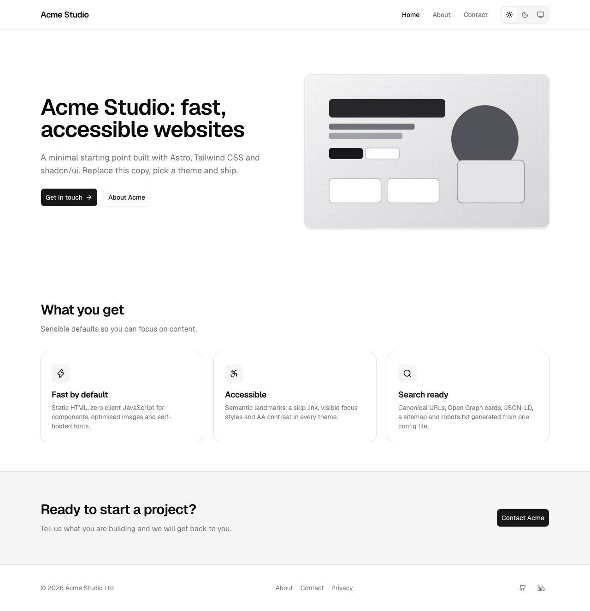
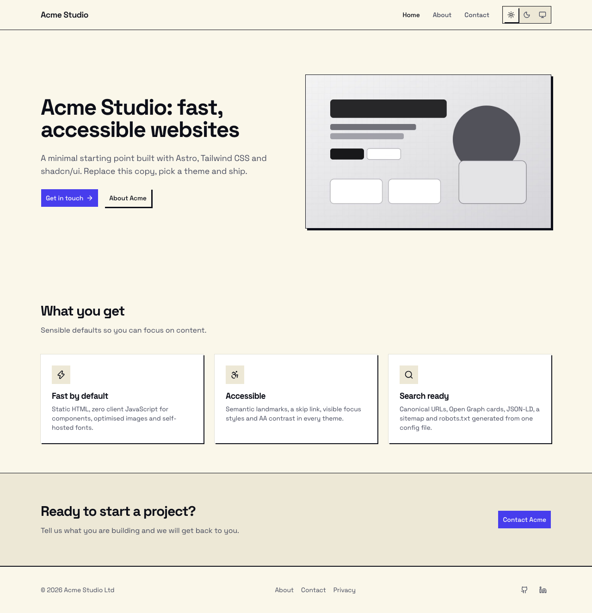
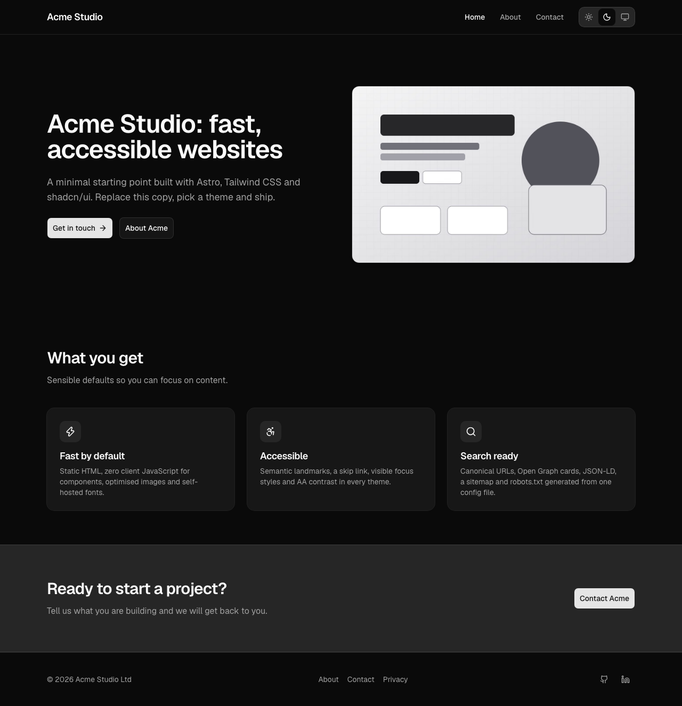
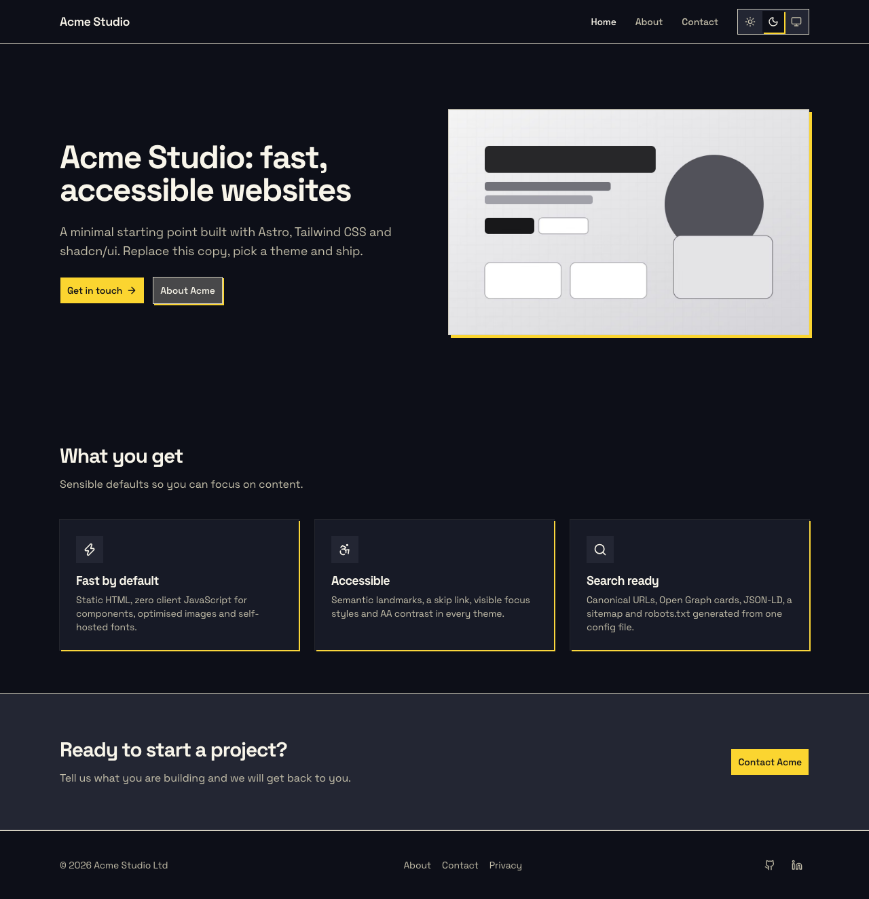

# Astro marketing-site template

**A fast, accessible, production-ready base for marketing and brochure sites.**
Static HTML, a theme system that restyles everything from a few CSS variables, and the SEO and security basics already done.


| Default theme                                          | Bold theme                                               |
| ------------------------------------------------------ | -------------------------------------------------------- |
|  |  |
|    |    |

_Same markup in all four screenshots. Only the theme tokens and colour mode change._

It's a base, not a design. Replace the placeholder copy, pick or build a theme, and ship.

## Why this template

- **Zero JavaScript by default.** shadcn/ui components are React, but they render to HTML at build time. The only client JS is a tiny theme script. Hydrate a component only when it needs real interactivity.
- **Themes that go beyond colour.** Each theme sets shadcn tokens plus fonts, radius, shadows, tracking and heading weight. Switch `data-theme` and the whole site changes, with no rebuild.
- **Light, dark and system modes.** Light is the default, and one config value changes it. The theme is applied before first paint, so there's no flash of the wrong theme.
- **SEO handled.** Meta tags, Open Graph and Twitter cards, canonical URLs, JSON-LD (LocalBusiness with opening hours, WebSite, BreadcrumbList), a sitemap, and `robots.txt` with an AI-crawler toggle and Content Signals.
- **Secure by default.** HSTS, clickjacking, referrer, permissions and COOP headers for Cloudflare, a minimal CSP that never gets in the way, and a generated `security.txt`.
- **Ready for AI agents.** A generated `/llms.txt`, TDMRep, and an `AGENTS.md` that tells coding agents the project's conventions.
- **Accessible.** Skip link, landmarks, visible focus, targets of at least 24px, reduced-motion and forced-colours support, and AA-contrast tokens.
- **One config file.** Brand, contact, nav, footer, SEO, robots and theme settings live in `src/site.config.ts`. The file is zod-validated, so a typo fails the build.

## What's inside

| Area       | Choice                                                                               |
| ---------- | ------------------------------------------------------------------------------------ |
| Framework  | Astro 7, static output, no adapter, clean URLs (`/about`)                            |
| Styling    | Tailwind CSS 4 (Vite plugin, no `tailwind.config`)                                   |
| Components | shadcn/ui (`base-vega` style, Base UI primitives), React 19 at build time only       |
| Blocks     | ~30 themeable Astro blocks for local business sites, no framework JS (`/components`) |
| Icons      | `astro-icon` + Iconify Lucide                                                        |
| Fonts      | Astro Fonts API: self-hosted and subsetted, with metric-matched fallbacks            |
| Pages      | Home, About, Contact, Privacy, 404, `/styleguide`, `/components` (block showcase)    |
| Tooling    | pnpm, TypeScript, `astro check`, ESLint (Astro, jsx-a11y), Prettier (Tailwind sort)  |
| Hosting    | Any static host; `_headers` and `_redirects` included for Cloudflare                 |

## Quick start

```sh
# From the CLI
pnpm create astro@latest -- --template phelma/astro-template

# Or click "Use this template" on GitHub, then clone your new repo.

pnpm install
pnpm dev          # http://localhost:4321
```

Open [`/styleguide`](http://localhost:4321/styleguide) to see every token, both themes in light and dark, and the installed components.

Requires Node `>=22.12` (`.nvmrc` pins 24) and **pnpm**.

## Next steps

- [`docs/new-site.md`](docs/new-site.md): make a site from the template, for you or a coding agent.
- [`docs/launch.md`](docs/launch.md): deploy and launch it.
- [`AGENTS.md`](AGENTS.md): conventions for writing code in the project.

## Scripts

| Command             | What it does                                                   |
| ------------------- | -------------------------------------------------------------- |
| `pnpm dev`          | Dev server with HMR.                                           |
| `pnpm build`        | Static build to `dist/`.                                       |
| `pnpm preview`      | Serve `dist/` locally.                                         |
| `pnpm check`        | `astro check` (TypeScript + `.astro` diagnostics).             |
| `pnpm lint`         | ESLint (TypeScript, Astro, jsx-a11y, React hooks).             |
| `pnpm format`       | Prettier (with Astro + Tailwind class sorting) over the repo.  |
| `pnpm format:check` | Prettier in check mode.                                        |
| `pnpm icons`        | Regenerate favicon / touch / PWA icons from `public/icon.svg`. |
| `pnpm og`           | Make the share image from the site's config and theme.         |

Before pushing: `pnpm format:check && pnpm lint && pnpm check && pnpm build`.

## Project structure

```text
public/
  _headers, _redirects          Cloudflare headers (security, caching) and redirects
  icon.svg, favicon.ico, ...    Icon set (generated by `pnpm icons`)
  og-default.png                Default social image (1200x630, generated by `pnpm og`)
scripts/generate-icons.mjs      Icon generator (sharp)
scripts/generate-og.mjs         Share image generator (sharp)
src/
  site.config.ts                Brand, contact, nav, SEO, robots, theme settings (zod-validated)
  layouts/BaseLayout.astro      <head> (SEO, social, icons, fonts, theme boot, JSON-LD) + page chrome
  components/
    layout/                     Header (Popover API mobile nav), Footer
    theme/                      ThemeToggle (light/dark/system), ThemeSwitcher (optional)
    seo/                        JsonLd, Breadcrumbs
    blocks/<name>/              Themeable Astro blocks (header, forms, map, hours, gallery, ...)
    showcase/                   Showcase + Demo layout for /components pages
    sections/                   Prose, plus thin wrappers over blocks (Hero, Features, CtaBand, PageHeader)
    ui/                         shadcn/ui components (button, card, badge, input, field, native-select, ...)
  lib/
    seo.ts                      Title, URL and JSON-LD helpers (LocalBusiness, WebSite, BreadcrumbList)
    hours.ts                    Opening hours: weekly table, special hours, summaries, "open now"
    contact-links.ts            tel:, mailto:, WhatsApp and Google Maps directions URLs
    ids.ts                      Deterministic, page-unique element ids for blocks
    theme-script.ts             Blocking head script (colour mode + theme)
    sitemap.ts                  noindexPaths (sitemap exclusions)
    ai-crawlers.ts              AI crawler user agents for robots.txt
  pages/
    index, about, contact, privacy, 404, styleguide (.astro)
    components/                 One showcase page per block (noindex)
    robots.txt.ts, llms.txt.ts, site.webmanifest.ts, .well-known/{security.txt,tdmrep.json}.ts
  styles/
    global.css                  Tailwind, shadcn base, token mapping, base styles
    themes/<name>.css           One file per theme
    themes/index.ts             Theme registry (labels, theme-color, fonts)
astro.config.ts                 site, env schema, fonts, sitemap, prefetch, images
.env.example                    Optional build-time variables (Google Maps keys)
AGENTS.md                       Rules for AI coding agents (CLAUDE.md is a symlink)
docs/
  new-site.md                   Making a site from the template
  launch.md                     Policy decisions, third parties, deploying, after launch
  themes.md                     How themes work, adding a theme, light/dark mode
  blocks.md                     Block catalogue, customising blocks, shadcn/ui
  reference.md                  SEO, security, performance, share image and icons: what you get and why
  spec-audit.md                 Website specification checklist, audited against the template
IDEAS.md                        Possible future improvements
```

## Configuration

Brand, contact, nav, footer, business details, SEO, robots and theme settings live in `src/site.config.ts`; each field is documented by a comment there. Set `site` in `astro.config.ts` to your production origin before deploying. More in [`docs/reference.md`](docs/reference.md#configuration).

## Themes

A theme is a CSS file of tokens (colours, radius, fonts, shadows, tracking, heading style) scoped to `data-theme`; the shadcn style decides component structure. Two themes ship, `default` and `bold`, plus light, dark and system colour modes. How it works and how to add your own: [`docs/themes.md`](docs/themes.md).

## Blocks and components

About 30 themeable Astro blocks for local business sites (heroes, opening hours, maps, booking, forms, testimonials, galleries, ...) live in `src/components/blocks/`, alongside shadcn/ui components rendered to static HTML. Browse them at `/components`. The catalogue and how to customise them: [`docs/blocks.md`](docs/blocks.md).

## SEO, security and performance

Meta and social tags, JSON-LD, sitemap, robots.txt, llms.txt, security.txt, security headers with a deliberately minimal CSP, and static, JS-free pages with optimised images and self-hosted fonts. What's emitted, the caveats and the reasoning: [`docs/reference.md`](docs/reference.md).

## Deploying

The build is plain static files in `dist/`, with `_headers` and `_redirects` for Cloudflare Workers or Pages. Deploy steps, staging, and adding an adapter for server routes: [`docs/launch.md`](docs/launch.md).

## Checklist coverage

The template targets the foundations, SEO, accessibility, security, performance, privacy and agent sections of the [website specification checklist](https://specification.website/checklist.md). [`docs/spec-audit.md`](docs/spec-audit.md) records which items it covers; the unticked ones are yours to decide. Possible future additions are in [`IDEAS.md`](IDEAS.md).
